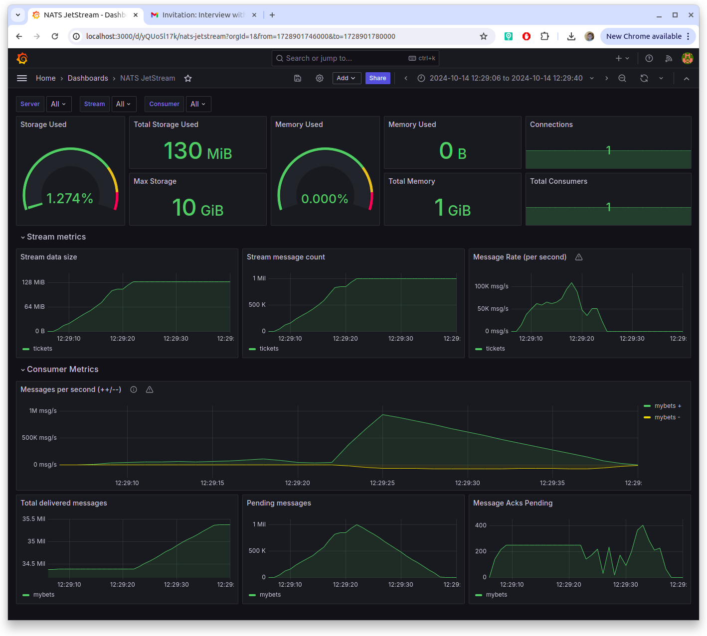

# Run
```
docker compose up
```

After the command is executed it will run performance test in 60 seconds that will "bet" 1 000 tickets which doesn't take any significant resources or time.  


# Result
It is possible to display the results of the execution by importing the dashboard with id `14725` using this http://localhost:3000/dashboard/import

The results for 1 mil. tickets looks like this. It takes approx 25 seconds on my 5-6 years old laptop to process it but the functionality is very limited at the moment.

